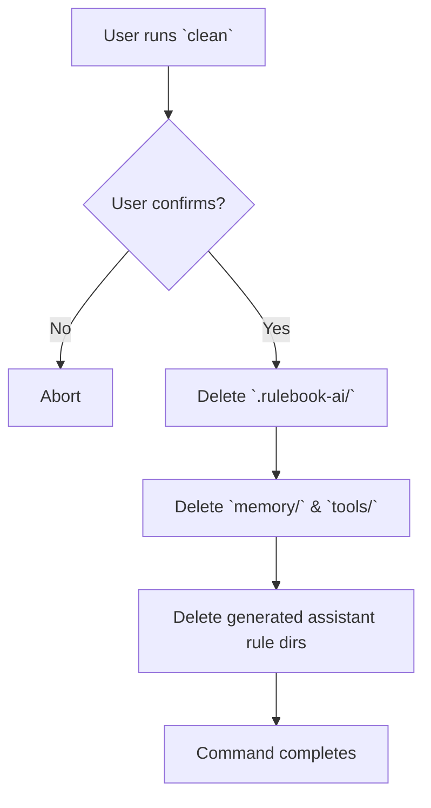
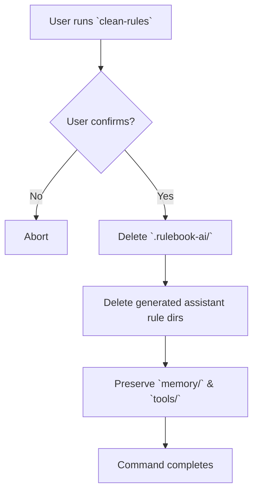

# Command Flow Diagrams

This document visualizes the high-level flow of major commands introduced in the composable pack system. Diagrams focus on
spec-level behavior rather than implementation details.

## `rulebook-ai packs add <name>`

```mermaid
flowchart TD
    A[User runs `packs add <name>`] --> B{Pack exists in source repo?}
    B -- No --> Z[Abort with error]
    B -- Yes --> C[Copy pack to `.rulebook-ai/packs/`]
    C --> D[Record name & version in `selection.json`]
    D --> E[Invoke implicit `sync` (see `sync` diagram)]
    E --> F[Command completes]
```

*`packs add` triggers an implicit `sync`; see the `sync` command diagram for how rules, memory, and tools are regenerated.*

## `rulebook-ai packs remove <name>`

```mermaid
flowchart TD
    A[User runs `packs remove <name>`] --> B{Pack active?}
    B -- No --> Z[Abort with error]
    B -- Yes --> C[Remove entry from `selection.json`]
    C --> D[Delete pack from `.rulebook-ai/packs/`]
    D --> E[Purge pack files from `memory/` & `tools/`]
    E --> F[Invoke implicit `sync` (see `sync` diagram)]
    F --> G[Command completes]
```

*`packs remove` triggers an implicit `sync`; see the `sync` command diagram for how remaining packs are rebuilt.*

## `rulebook-ai sync`

```mermaid
flowchart TD
    A[User runs `sync` (optional flags)] --> B{Assistant flags provided?}
    B -- Yes --> C[Explicit mode: target listed assistants]
    B -- No --> D[Implicit mode: detect existing rule dirs]
    C --> E[Delete generated rules for targets]
    D --> E
    E --> F[Merge active packs into `memory/` & `tools/`]
    F --> G[Warn on conflicts or abort in `--strict` mode]
    G --> H[Generate combined rules for targeted assistants]
    H --> I[Command completes]
```

## `rulebook-ai clean`



## `rulebook-ai clean-rules`



