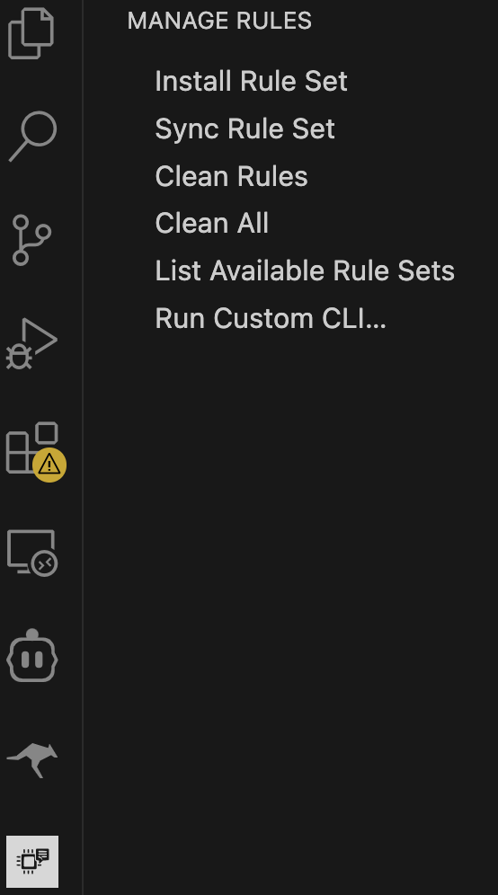
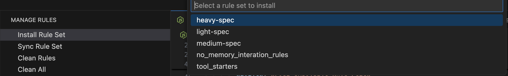
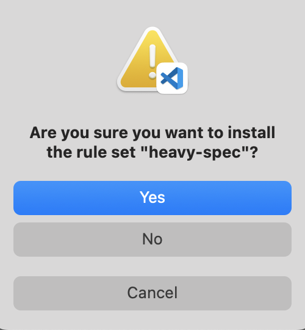
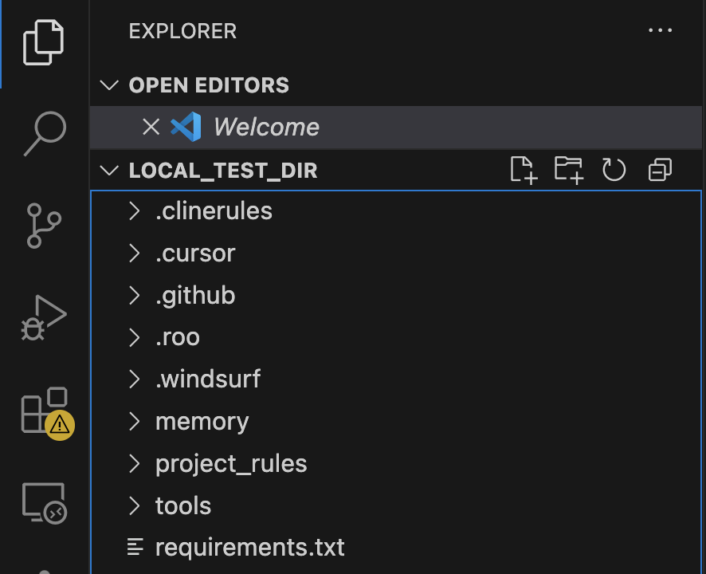

<!-- Badges -->

# 🧩 Manage Rules – Universal **AI Coding Rules** Manager for VS Code

Bring **consistent, context-rich AI assistance** to every repo you touch—across Cursor, GitHub Copilot, CLINE, RooCode & Windsurf —without leaving VS Code with powerful AI memory bank prompts.

---

### ✨ Why you’ll love it

- **One-click install** of a curated rule-set & “memory bank” that makes any AI assistant *project-aware*.
- **Works everywhere** your AI does: generates `.cursor/rules`, `.clinerules`, `.windsurf/rules`, Copilot instructions—automatically.  
- **Always in sync**: update rules once, hit **Sync**, done.  
- **Clean exits**: nuke generated files or the whole framework with **Clean Rules / Clean All**.  
- **Zero-config**: Python script is bundled; respects your workspace’s Python path if you want.  
- **Open-source & extensible**: MIT-licensed, backed by the [Rulebook-AI](https://github.com/botingw/rulebook-ai) project.

> “Finally my Cursor and Copilot follow the same playbook.” — Early adopter

---

## 🚀 Quick Start (30 sec)

1. **Open** the project folder in VS Code.  
2. Click the **Manage Rules** icon in the Activity Bar.  
3. Hit **Install Rule Set** → pick `light-spec` (or any set).  
4. Watch the integrated terminal finish; start coding with a smarter AI!

*(Need a different rule later? Use **Sync** after editing `project_rules/`.)*

---

## 📸 Live demo

> **Replace the placeholders below with your assets**

| | |
|:-:|:-:|
|  |  |

### 📸 Installation Flow

Follow these four simple steps to see how **Manage Rules** installs a rule set into your workspace:

1. **Open the “Manage Rules” Sidebar**  
   Click the “Manage Rules” icon in the VS Code Activity Bar to reveal all available commands.  
     
   *Click the puzzle-piece icon at the bottom left (or wherever you pinned it) to expand the Manage Rules menu.*

2. **Select “Install Rule Set” & Choose Your Rule Set**  
   From the sidebar commands, click **Install Rule Set**, then pick a rule set (e.g. `heavy-spec`).  
     
   *Type or scroll to the rule set you want, then press Enter.*

3. **Confirm Installation**  
   VS Code will pop up a confirmation dialog. Click **Yes** to begin.  
     
   *Once you click Yes, the extension will run the bundled Python script in the integrated terminal.*

4. **Verify Generated Folders in Your Workspace**  
   After the script finishes, you’ll see new folders (e.g. `.cursor/`, `.clinerules/`, `.windsurf/`, etc.) plus `project_rules/` appear at your workspace root.  
     
   *These folders contain the platform-specific rule files and memory definitions you selected.*

---

👏 That’s it! Your chosen rule set is now installed. To update later, simply click **Sync Rule Set** from the same sidebar. If you want to start fresh, use **Clean Rules** or **Clean All**.

---

## 🔍 Commands & Settings

| Command | Palette ID | What it does |
|---------|------------|--------------|
| **Install Framework** | `Manage Rules: Install` | Copy chosen rule set + memory, then run an initial **sync**. |
| **Sync Rules** | `Manage Rules: Sync` | Regenerate platform-specific rule folders. |
| **Clean Rules** | `Manage Rules: Clean Rules` | Delete generated rule folders & `project_rules/`. |
| **Clean All** | `Manage Rules: Clean All` | Full uninstall: rules, memory, tools, env files. |
| **List Rule Sets** | `Manage Rules: List Available Rule Sets` | Peek at available rule-set names. |
| **Run Custom CLI…** | – | Type any `manage_rules.py` args yourself. |

Extension settings

| Setting | Default | Purpose |
|---------|---------|---------|
| `manageRules.pythonPath` | `python3` | Interpreter used to run the backend script. |

---

## 💡 How it works (under the hood)

The extension is a **thin Node.js wrapper** that triggers the backend `manage_rules.py` script inside VS Code’s Integrated Terminal. Six static commands in a sidebar cover all common workflows; anything else you can run via *Custom CLI*.​ 

---

## 🛣 Road-map

- Multi-root workspace support  
- Webview with progress & file preview  
- Auto-sync on rule edits  
- `.gitignore` helper for generated files  

*(Vote or file new ideas in [Discussions](https://github.com/botingw/rulebook-ai/discussions))*.

---

## 🤝 Need help or have ideas?

- Open an [**Issue**](https://github.com/botingw/rulebook-ai/issues) in the repo  
- Drop anonymous feedback via our [Google Form](https://docs.google.com/forms/d/e/1FAIpQLSeW57QtPEWIRhHY1iOb8f5KQZTGLSeeb_PN2iZLd0Aw_pVYxw/viewform)  
- Chat with us in the GitHub **Discussions** tab  

---

> © 2025 Bo-Ting Wang · MIT License
